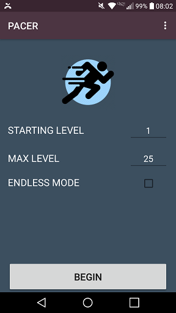
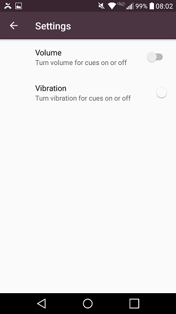
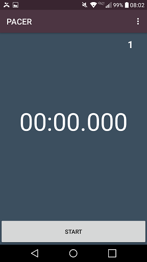
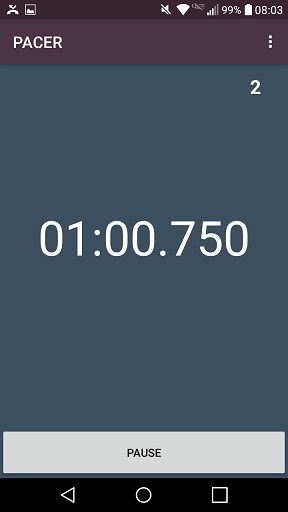

# PACER
Android Application that paces the user's shuttle runs and progressively increases the pace.

## About
PACER is an Android App built using Android Studio which helps the user design shuttle runs similar to the PACER Multi-Stage Fitness test. The logic, by default, follows the PACER Multi-Stage Fitness test exactly, but the user can customize the workout to fit their needs: the user can change the starting level, ending level, and if the workout should be endless. The motivation to create this app was to provide users with a simple app to keep their pace during shuttle runs.

## Using PACER
Opening the app will show a simple screen which allows the user to designate at Starting Level, Max Level, and whether the workout should be Endless. Levels dictate the duration of each individual shuttle. The recommended shuttle distance, as in the Multistage Fitness Test, is 20 meters. On the top right, there is a drop down menu where Settings can be accessed; from here, you can toggle audio cues and vibration cues.

## Screenshots
 
###### On the left is the Main Screen of the application. On the right is the settings Menu where vibration and audio cues are changed. Audio and Vibration cues settings are always accessible via the drop down on the top right of the application.
\
\
\
 
###### The left is the view after pressing the 'Begin' button on the Main Screen. The right is the view of the timer while a workout is in progress. Current Level is displayed on the top right.
